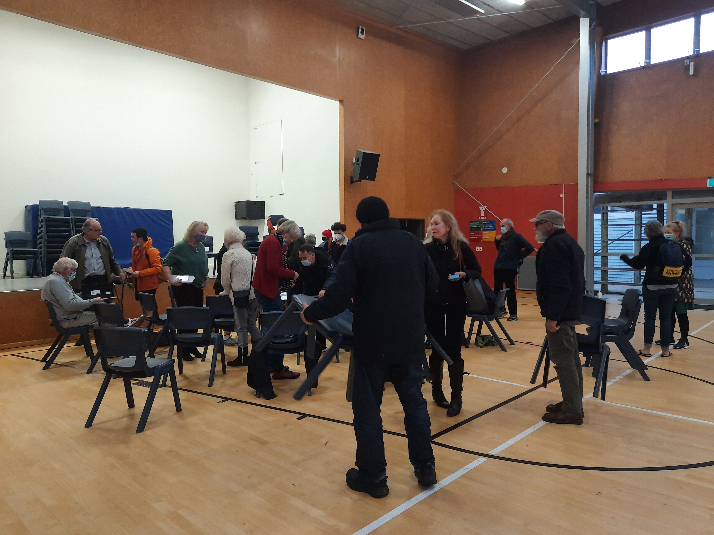

+++
title = "Doctoral Research"

# View.
#   1 = List
#   2 = Compact
#   3 = Card
view = 1

# Optional featured image (relative to `static/img/` folder).
[header]
image = ""
caption = ""
+++

**Background**  
New Zealand is exposed to many natural hazards and have experienced devastating disasters in the past. The impact of these hazards can be reduced if people at risk from the hazards are adequately prepared. Recognizing this, some residents of hazard prone areas across New Zealand are now taking steps to prepare themselves, not only at an individual level but also at a community level through community actions. Through these actions community members may prepare community emergency plans, collect, and store resources for emergency situations, work with civil defence officials towards establishing community emergency hubs, call for attention to concerns facing their community etc. My PhD explores how all this is happening and what role communication plays in the process. I am working under Dr. Julia Becker and Dr. Emma Hudson-Doyle at the Joint Centre of Disaster Research at Massey University.

**My research so far**  
I started my PhD by speaking with civil defence officials and community leaders across seven regions in New Zealand to understand what is currently happening. During these discussions it became evident that the nature and form of community actions vary based on the hazard history and demographic characteristics of the communities. To understand these variations, we decided to develop three case studies, one each in Bay of Plenty, Wellington, and Southland regions. Currently I am conducting my interviews with community action leaders and community members from these regions to develop the cases. Once this is done, I will look specifically at how these communities used communication to facilitate community actions. Then in the later stage in my PhD, the challenge will be to check how my findings on a few communities translate to other communities in New Zealand.